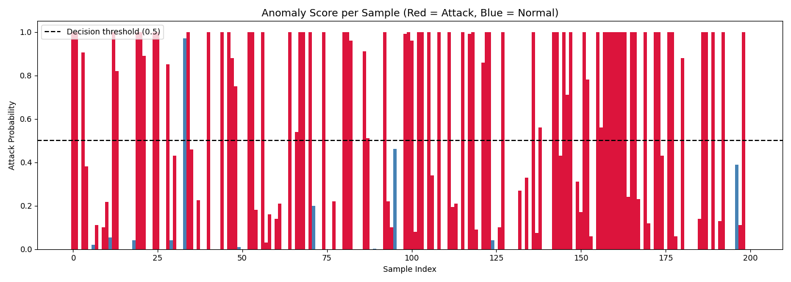
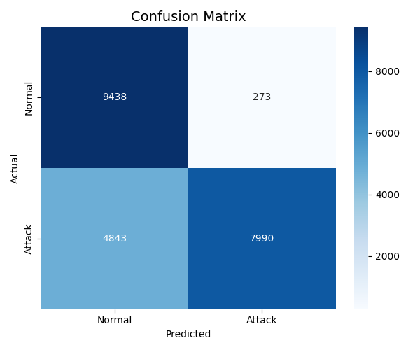
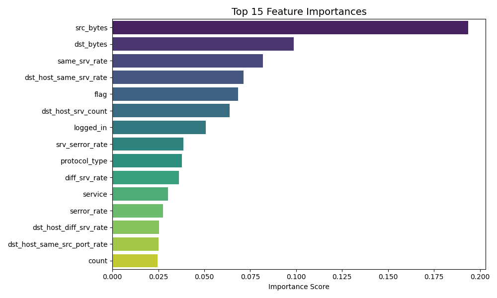
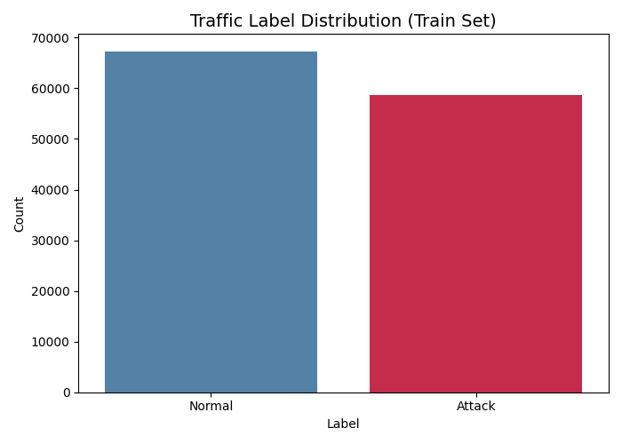

🛡️ AI-Powered Cybersecurity Threat Detection

## 📌 Overview
This project builds an AI system that detects cyberattacks and network intrusions
using machine learning. It analyzes network traffic data and classifies each 
connection as **Normal** or **Attack** — simulating how real-world Security 
Operations Centers (SOCs) protect systems from threats like DoS, brute force, 
and unauthorized access.

Built using the **NSL-KDD dataset** — a standard benchmark used in cybersecurity 
research worldwide.

---

## 🚨 Problem Statement
Traditional security systems rely on fixed rules and fail to catch new or evolving 
threats. This project uses AI to **learn patterns** from historical network traffic 
and automatically flag suspicious behavior — making threat detection smarter and 
faster.

---

## 🏢 Industry Relevance
Companies like **Google, Microsoft, IBM Security, and Palo Alto Networks** use 
similar AI-driven systems for:
- Real-time network monitoring
- Intrusion detection
- Fraud and anomaly detection
- Automated threat response

---

## 🧠 Tech Stack

| Tool | Purpose |
|------|---------|
| Python 3.10 | Core language |
| Pandas + NumPy | Data preprocessing |
| Scikit-learn | Random Forest classifier |
| Matplotlib + Seaborn | Visualizations |
| Flask | REST API for predictions |
| Joblib | Saving trained model |

---

## Installation & Setup

1. Clone the Repository
git clone https://github.com/nupurmorajkar/AI-Cybersecurity-Threat-Detection.git
cd AI-Cybersecurity-Threat-Detection

2. Create and Activate Virtual Environment
python -m venv cybersec_env
For Windows:
cybersec_env\Scripts\activate
For macOS/Linux:
source cybersec_env/bin/activate

3. Install Required Dependencies
pip install -r requirements.txt

## 📸 Screenshots

## 📊 Anomaly Scores

  

## 📉 Confusion Matrix

  

## 📈 Feature Importance

  

## 📊 Label Distribution

  

## 🔮 Future Improvements
- Live packet capture using Scapy
- LSTM-based deep learning model for sequential detection
- Real-time dashboard using Streamlit
- Cloud deployment on AWS / Azure
